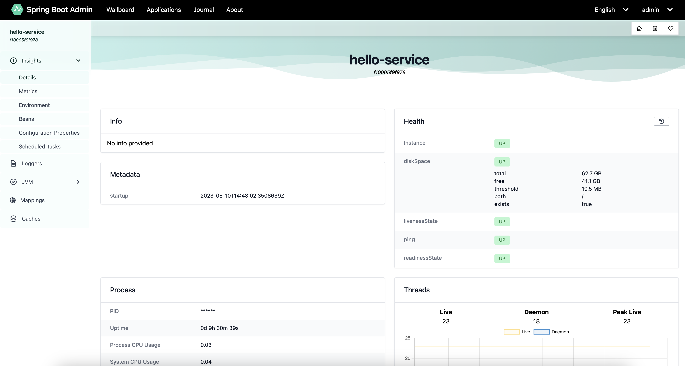

<h1 align="center" style="font-weight: bold; margin-top: 20px; margin-bottom: 20px;">Spring Boot Admin</h1>

  
  
  
  
  
  
  
  
  
  
  
  
  
  
  
  
  
  
  
  
  

The repository hosts a Spring Boot Admin server capable of the discovering services in Kubernetes environment when provided with appropriate permissions. The admin probes the services through their actuator interface. The monitored services should use the Spring Boot Admin client by including its dependency in their pom.xml to register themselves with the Admin server to allow additional details for better monitoring.   

# Build
> mvn clean package

# Build Docker Image
> mvn k8s:build
>
Building the application jar is a pre-requisite for building the docker image.

# Deploying to Kubernetes
> mvn k8s:resource k8s:apply
>
Building the docker image is a pre-requisite for deploy.

# HTTP interface
The application exposes the Spring Boot Admin dashboard on the default HTTP port `10000`. The default login credentials are `admin/admin`.

# Screenshots

